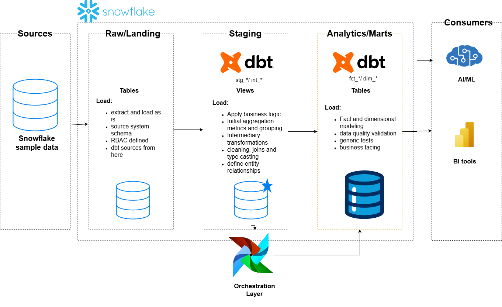

# ❄️ Snowflake ELT Pipeline with dbt & Airflow

## 📌 Overview

This project showcases a **modern ELT pipeline** built on **Snowflake**, using **dbt** for transformations and data quality, and **Airflow** for orchestration.

The pipeline transforms raw source data into **analytics-ready fact and dimensional models** following analytics engineering best practices.

---

## 🏗 Architecture

**Flow:** 

**Sources → Raw/Landing → Staging → Analytics/Marts → Consumers**

---

## 🧱 Data Layers

### 🔹 Raw / Landing
- Source-aligned tables loaded *as-is*
- No business logic applied
- dbt `sources` defined here
- RBAC boundaries established

### 🔹 Staging (`stg_*`, `int_*`)
- Cleaning, type casting, and normalization
- Business logic and transformations
- Intermediate aggregations
- Entity relationships defined

### 🔹 Analytics / Marts (`fct_*`, `dim_*`)
- Fact and dimensional models
- Business-facing metrics
- dbt tests for data quality
- Optimized for BI and downstream analytics

---

## 🔄 Orchestration

- **Airflow** schedules and orchestrates dbt runs
- Handles retries and execution order
- Decoupled from transformation logic

---

## ✅ Data Quality & Governance

- dbt tests for:
  - Uniqueness
  - Not-null constraints
  - Referential integrity
- Built-in lineage and documentation via dbt

---

## 📊 Consumers

- BI tools
- Ad-hoc analytics
- AI/ML workloads

---

## 🧠 Skills Demonstrated

- Snowflake data warehousing
- ELT architecture
- dbt modeling, testing, and macros
- Fact & dimensional modeling
- Airflow orchestration
- Analytics engineering best practices

---

## 🚀 Why This Project

- Warehouse-native ELT design
- Clear separation of concerns
- Scalable and maintainable transformations
- Business-ready analytical outputs

## 🛡️ License

This project is licensed under the [MIT License](LICENSE). You are free to use, modify, and share this project with proper attribution.
